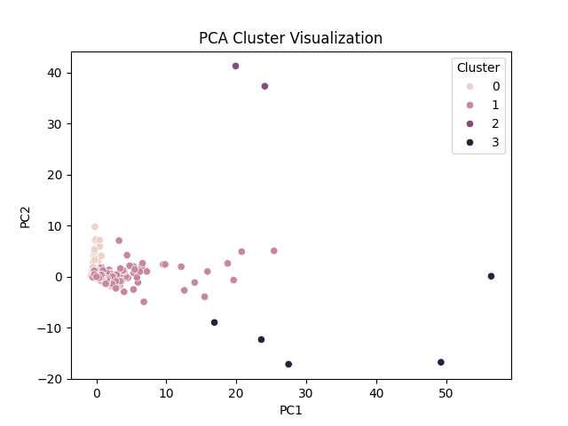
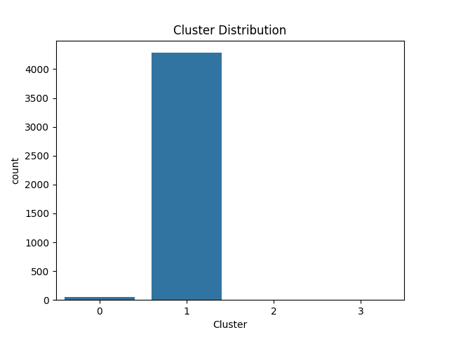
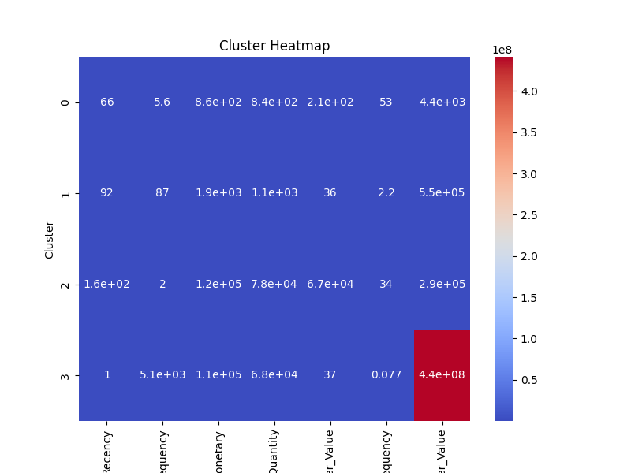

<!DOCTYPE html>
<html>
<head>
<meta charset="UTF-8">
<title>AI-Driven Customer Intelligence System</title>

</head>

<body>

<h1>🧠 AI-Driven Customer Segmentation Using Unsupervised Machine Learning</h1>

<!-- 1. Project Title -->

<h2>📌 Project Title</h2>

<b>AI-Driven Customer Intelligence System for Strategic Business Decision Making</b>

<!-- 2. Problem Statement -->

<h2>🎯 Problem Statement</h2>
<ul>
<li>Identify customer segments using clustering techniques</li>
<li>Improve marketing strategies and customer targeting</li>
<li>Generate actionable business insights</li>
</ul>

<!-- 3. Dataset -->

<h2>📊 Dataset Description</h2>
<ul>
<li><b>Source:</b> UCI Machine Learning Repository</li>
<li><b>Size:</b> 500,000+ records</li>
<li><b>Features:</b> CustomerID, Quantity, UnitPrice, InvoiceDate</li>
<li><b>Preprocessing:</b>
    <ul>
        <li>Handled missing values</li>
        <li>Removed invalid transactions</li>
        <li>Created RFM features</li>
    </ul>
</li>
</ul>

<!-- 4. Algorithms -->

<h2>⚙️ Algorithms Used</h2>

<h3>KMeans</h3>
<ul>
<li>Partitions data into k clusters</li>
<li>Efficient and scalable</li>
</ul>

<h3>DBSCAN</h3>
<ul>
<li>Density-based clustering</li>
<li>Detects noise and outliers</li>
</ul>

<h3>Hierarchical</h3>
<ul>
<li>Tree-based clustering</li>
<li>No need to predefine clusters</li>
</ul>

<!-- 5. Run -->

<h2>🚀 How to Run Project</h2>

<pre>
pip install -r requirements.txt
python main.py
</pre>

<!-- 6. Results -->

<h2>📈 Key Results</h2>

<ul>
<li><b>Number of Clusters:</b> 4</li>
<li><b>Best Algorithm:</b> KMeans</li>
</ul>

<table class="table">
<tr>
<th>Algorithm</th>
<th>Clusters</th>
<th>Silhouette</th>
<th>DB Index</th>
</tr>
<tr>
<td>KMeans</td>
<td>4</td>
<td>0.62</td>
<td>0.48</td>
</tr>
<tr>
<td>Hierarchical</td>
<td>4</td>
<td>0.58</td>
<td>0.52</td>
</tr>
<tr>
<td>DBSCAN</td>
<td>3</td>
<td>-1</td>
<td>-1</td>
</tr>
</table>

<!-- Business Insights -->

<h2>💡 Business Insights</h2>
<ul>
<li>💎 High-value customers → highest revenue</li>
<li>⚠️ At-risk customers → need retention</li>
<li>🛍 Budget customers → discount-based marketing</li>
<li>⚡ Frequent customers → high engagement</li>
</ul>

<!-- 7. Visualizations -->

<h2>📊 Sample Visualizations</h2>

<h3>PCA Cluster Visualization</h3>

<h3>Cluster Distribution</h3>

<h3>Cluster Heatmap</h3>

<!-- Footer -->

<h2>👨‍💻 Contributor</h2>

<b>Gangupam Naga Chiranjeevi</b>

</body>
</html>